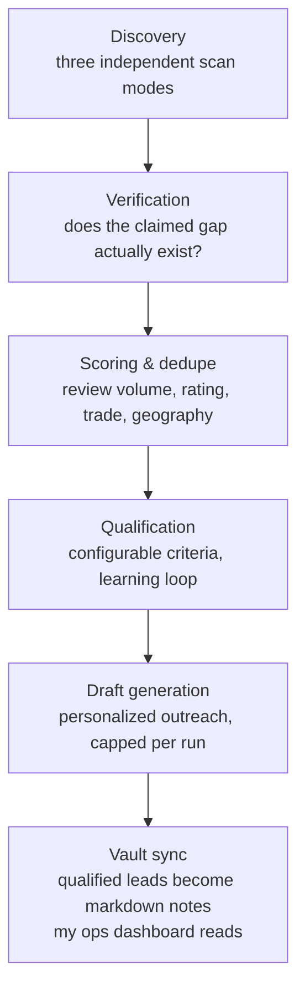

# Lead Scanner — Architecture Showcase

A Node.js pipeline I built and run for my web studio, [Tomko Digital](https://www.tomkodigital.com). It finds local businesses that customers already love but that have no (or badly broken) web presence — then qualifies, scores, and syncs them into my operations vault for human outreach.

**This repo is docs-only on purpose.** The scanner is the engine of my business development, and the working code — scoring rules, thresholds, targeting, draft templates — is the part that took real iteration to get right. You get the architecture so you can see how I think; the tuned pipeline stays private so it stays mine. Ask me about any module and I'll talk your ear off.

## The pipeline

### Discovery — three modes, because one search angle misses things
- **Supply-side:** businesses whose existing sites are broken or outdated (web search + automated page audits)
- **Demand-side:** people publicly asking for web-design help (forum/classifieds search)
- **No-site:** well-reviewed businesses on map platforms with no website at all — the best leads, verified against fresh listing data

### Design decisions I'd defend

- **No send capability, by design.** The scanner drafts; a human reviews and sends. Automating outreach volume is easy — automating judgment isn't, so I didn't pretend to.
- **Verification before contact.** Nothing reaches a call sheet until the claimed gap (no site, broken site) is confirmed fresh — an early failure taught me that scraped truth decays fast.
- **A learning loop, not a static filter.** Every human good/bad verdict on a lead feeds back into scoring, so the pipeline gets more like my taste over time.
- **Plain files as the interface.** Output is markdown + JSON that my [ops dashboard](https://github.com/anonmilkbox/tomko-os) reads directly. No database, no queue — the vault is the API.
- **Respect platform rules.** Login-gated platforms aren't scraped; the tool generates search links and a paste-in scorer for manual review instead.

## Stack

Node (ESM, no framework), a maps/place-data API, Firecrawl for search/scrape, plain-file storage. Built in partnership with Claude as my development copilot.

---

More: [github.com/anonmilkbox](https://github.com/anonmilkbox)
